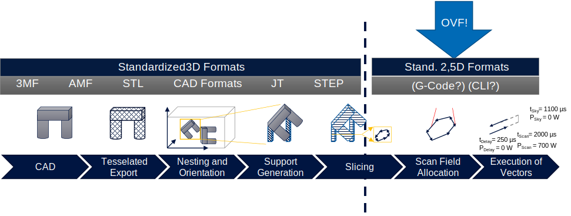
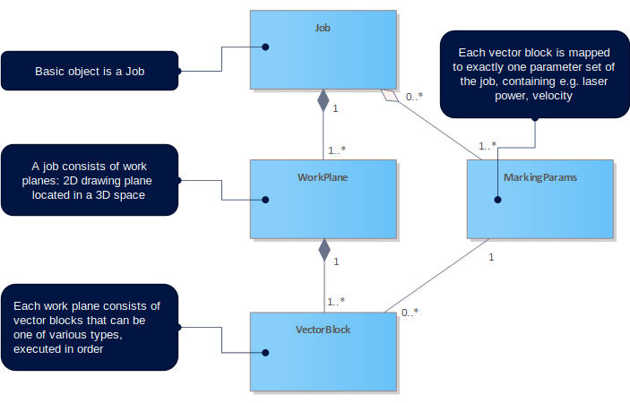
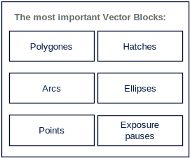

# OpenVectorFormat

A format description based on Google protobuf. The format is used for controlling a laser in combination with a galvanometer scanner. It supports multi scanfield arrays as well as additional machine axis controls.

**Just looking for a "How to use?" --> [Here you go!](README.md#ovf-file-structure)**

## Why another format?

The first question to adress is for course: why another format? Often, the introduction of a new format to "unify all the existing ones" leads to a situation of there just being yet another format, as beautifully shown in this [xkcd](https://xkcd.com/927/).

### Status quo
In scanner-based laser manufacturing, a process chain typically starts with the generation of the structure to be processed in some CAD application, where there are several formats such as STEP (STandard for the Exchange of Product model data) or STL (Standard Tessellation Language) that can be used in a wide variety of tools - thus, a favorable situation of two very capable, widely supported de-facto standards.

For laser processing with a galvanometer scanner, this 3D geometry data needs to be converted into a collection of 2D layer data. This conversion is usually done through a slicer – and for the output of the slicer, there is no standard format with wide industry support.

Currently, various formats are used:
- There is G-Code, which was originally designed for very different applications, and is thus lacking some of the requirements such as defining various laser and scanner parameters.

- There are specialized formats written for exactly one use-case with limited documentation and capabilities for a broader application. 

Nearly all of the formats lack the capability to store meta-data about parts and processing steps, which is required to associate process monitoring information with specific steps of the processing job. 

This is exactly the point where OpenVectorFormat plugs into the data pipeline.

Thus, we are confident that the OpenVectorFormat will not be "just another format" alongside other, similarily well suited formats. It is the first truly open, feature rich format for the growing range of scanner based laser applications.

## Basic Object Model

The basic object model of the Open Vector Format is derived from the layer wise build up process of 2.5D manufacturing processes and shown in the figure below.

### Job

The job object represents the whole job the machine shall manufacture. It is the root object of the model. Contained in the job are two data objects: A list of WorkPlane objects and a map of MarkingParams objects. 
This data objects contain all information that is required for the machine to manufacture the job. Additionally, the job contains several metadata objects.
Most important of these metadata objects is the Part object map.

### WorkPlane

The WorkPlane object represents a two-dimensional drawing plane located in three-dimensional space, its name derives from the CAD concept with similar function. 
The WorkPlane is probably the most defining object since it shows and limits the use case of the Open Vector Format.

The object model aims at processes that use a motion system (e.g. (multi-)axis system, industrial robot) to position a build object 
(e.g. LPBF build plate, object to be structured / engraved) relative to a vector based actuator (e.g. galvanometer scanner with laser source, magnetic field deflector with electron beam). The movements of both actuators are expected to happen consecutively and not simultaneous. Thus e.g. for LPBF the z-axis first moves the build plate into the correct height and after the movement is finished the laser actuator starts vector execution. 
Goal coordinates for the motion system are stored in the work plane object itself.

### VectorBlock

The VectorBlock object represents a set of vectors that share the same metadata and process parameter set. Each vector block is mapped to one specific set of marking parameters from the job via an index. 
The VectorBlock object exists mainly for performance reasons and storage space efficiency. Vector blocks can adapt one of several available types that define how exactly the point coordinate data is stored and shall be interpreted by the machine controller software. The most common VectorBlock types are “Hatches” and “LineSequences” (also known as polygones).
Hatches are defined as a set of straight lines that are not connected to each other and are commonly used to create the “filling” of parts. LineSequences are a set of connected straight line segments that are commonly used to create closed contours lines. Vector block types act as a flexible extension point of the format. The machine controller software can check the vector block type and can only execute known types.
 
If a specialized vector block type is beneficial for a use case, both the vector generating code as well as the machine controller can be extended to support other types while still utilizing the other parts of the job structure. For example arcs and ellipses have been added as additional vector block types. This geometric shapes can directly be executed by some galvanometer controller cards and are more efficient for manufacturing e.g. lattice structures than representing the circular contours with polygons. 

Additionally for multi-laser machines each vector block can store an index of the executing laser unit if the vector allocation is generated upfront and not on the machine.

### Marking Params

The MarkingParams object contains process parameters for the execution of the vectors like marking speed, power and abstract parameters for configuring the closed loop controller that controls the laser beams positional accuracy. This includes feed-forward parameters like delays as well as acceleration and deceleration compensation (“Skywriting”) set points like prerun and postrun times. It is up to the machine controller software to calculate the real set points from the abstract description considering the hardware components specifications, safety limits etc.

### Meta data
The basic objects Job, WorkPlane and VectorBlock contain additional fields for meta data related that object. The most relevant Metadata object is the Part. 
Many AM processes like LPBF create a whole batch of parts at once that get separated later. The information about the part relationship is not relevant for the printing process itself, but highly relevant for applications that process the data after slicing. Especially quality assurance applications need this relationship to connect data that is generated during or after AM processing like process monitoring sensor data and quality control measurements with the machine code.

## The tech behind
The OpenVectorFormat description is based on Google Protobuf. Protobuf already satisfies many of the technical requirements for a format like this:
- Offering a space efficient binary encoding to handle large jobs with multiple gigabytes of data
- High (de)serialization performance in various languages including C++, C#, Java and Python.
- An easy way to implement a streaming concept on top of it
- With gRPC as remote procedure call framework, communication and seamless transfer of the data between multiple applications is easily possible.
- Easily extensible with backwards compatibility by default

# How to use
The recommended way to use OpenVectorFormat in your software is to use our reference implementation [OpenVectorFormatTools](https://github.com/Digital-Production-Aachen/OpenVectorFormatTools). It provides basic tooling for a seamless integration in C#, e.g. a file reader / writer with streaming support, consistency checks for jobs, and a gRPC wrapper for easy use with other languages.

If you prefer not to use those tools, you can either use the [Workspace](WORKSPACE) file to pull & build standalone versions of the Protobuf & gRPC libraries in your `bazel` workflow. Or just take the [open_vector_format.proto](open_vector_format.proto) file directly. In this case, you should be knowing what you are doing since you need to integrate the protobuf and gRPC libraries manually into your software.

# OVF File Structure
Since the protobuf messages itself just describe a data format, but not a file format, some additional steps are required to read / write jobs from and to files. As mentioned in the "How to use" section above, the recommendation is to use the [reference implementation for readers and writers](https://github.com/Digital-Production-Aachen/OpenVectorFormatTools/tree/main/ReaderWriter) whenever possible. 

To enable selective streaming of various elements of a job from the file, the Job protobuf message cannot simply be seriallized and dumped to a file. Instead, the job is seriallized in parts and the position of the parts is indicated by look-up-tables (LUTs).

The LUTs themselves are protobuf messages, the .proto file can be found at [ovf_lut.proto](ovf_lut.proto).

All protobuf messages (LUTs, JobShell, WorkPlaneShells, VectorBlocks) are written to the file using the `WriteDelimitedTo` method and can be read using the `ParseDelimitedFrom` method in protobuf libraries.
The writeDelimited methods first read / write the length in bytes of the protobuf message from / to the stream as VarInt32 (defined by protobuf) and then parse the data. They are not available in all language implementations default libraries, reading and writing of the length might have to be implemented manually. Some help to this can be found here: https://stackoverflow.com/questions/2340730/are-there-c-equivalents-for-the-protocol-buffers-delimited-i-o-functions-in-ja/22927149#22927149

## Structure overview

| Length (bytes) | Description | Values | Annotation |
|---|---|---|---|
| 4      | Magic number | [0x4c, 0x56, 0x46, 0x21] |
| 8     | Position of Job LUT in File (Int64, LittleEndian)      |   |
| 8 | Position of LUT for Workplane 0 in file (Int64, LittleEndian) | | Start of part of the file for WorkPlane 0 |
| var | VectorBlock 0 of WorkPlane 0      |     |
| var | VectorBlock 1 of WorkPlane 0      |     |
| var | VectorBlock 2 of WorkPlane 0      |     |
| ... | ...      | ...     |
| var | WorkPlaneShell of WorkPlane 0 (WorkPlane message with empty vector-blocks array) | |
| var | WorkPlane LUT for WorkPlane 0 | |
| 8 | Position of LUT for Workplane 1 in file (Int64, LittleEndian) | |  Start of part of the file for WorkPlane 1 |
| var | VectorBlock 0 of WorkPlane 1      |     |
| var | VectorBlock 1 of WorkPlane 1      |     |
| ... | ...      | ...     |
| var | WorkPlaneShell of WorkPlane 1 (WorkPlane message with empty VectorBlocks array) | |
| var | WorkPlane LUT for WorkPlane 1 | |
| ... | ...      | ...     |
| var | JobShell (Job message with empty WorkPlane array) ||
| var | JobLUT || 

## JobLUT
The JobLUT contains 
- the position of the JobShell in the file
- an array of starting positions for each WorkPlane. At this given position in the file, there is an Int64 which in turn gives the position for the WorkPlaneLUT. 

On the first glance, it might seem counter-intutive that there is one Int64 in front of every WorkPlane to indicate the position of the WorkPlaneLUT, instead of just writing the position of the WorkPlaneLUT in the array in the JobLUT directly.

However, to speed up parsing of a job and parse multiple WorkPlanes at once, one can set up multiple sub-streams, one for each WorkPlane, and those sub-streams require the start and end of the part of the file they should work on. And by writing the starting position of the part of file for each WorkPlane into the WorkPlanePositions array in the JobLUT, the start and end position for the part of the file containing a specific WorkPlane is directly visible (see table above).

## WorkPlaneLUT
A WorkPlaneLUT contains
- the position of the WorkPlaneShell in the file
- an array of the starting positions for the VectorBlocks of this WorkPlane. 

Here, the array of starting positions direclty indicates the starting position of a VectorBlock protobuf message that can be parsed directly.
